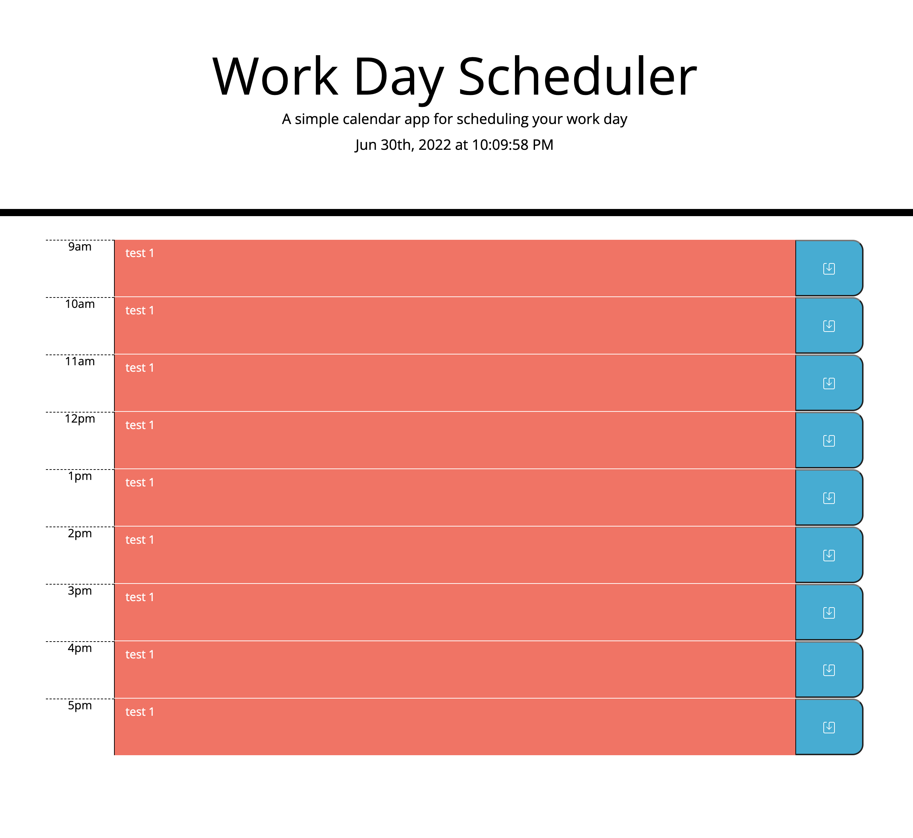

# Work Day Scheduler

## Description

The purpose of this project is to create a calendar application that allows a user to save events for each hour of the day. The app runs in the browser and features dynamically updated HTML and CSS powered by jQuery.

## Goal

### User Story

AS AN employee with a busy schedule
I WANT to add important events to a daily planner
SO THAT I can manage my time effectively

### Acceptance Criteria

GIVEN I am using a daily planner to create a schedule
WHEN I open the planner
THEN the current day is displayed at the top of the calendar
WHEN I scroll down
THEN I am presented with time blocks for standard business hours
WHEN I view the time blocks for that day
THEN each time block is color-coded to indicate whether it is in the past, present, or future
WHEN I click into a time block
THEN I can enter an event
WHEN I click the save button for that time block
THEN the text for that event is saved in local storage
WHEN I refresh the page
THEN the saved events persist

## Installation

In order to view the work day scheduler, you will need to visit the live deployment URL: https://ajcodes-cyber.github.io/work-day-scheduler/

## Usage

## Credits

* I worked with a classmate, Tanner Ruminer, on this assignment.

## License

No License necessary

## Features

Semantic tagging was used in html file to adhere to accessibility needs.
